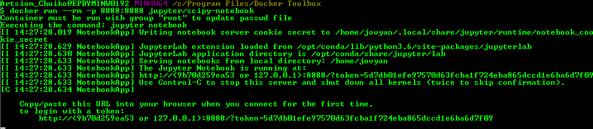
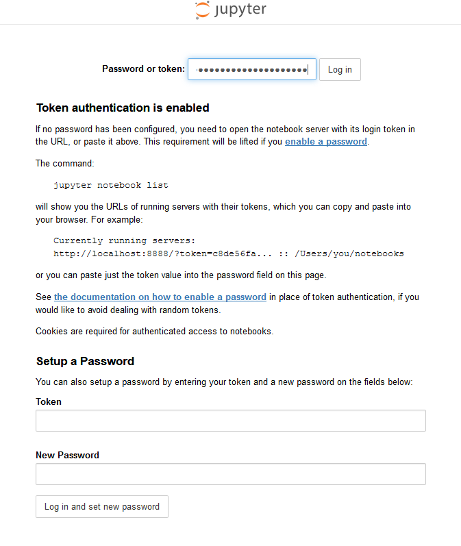
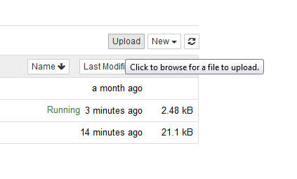
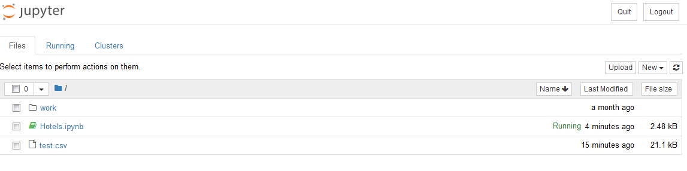
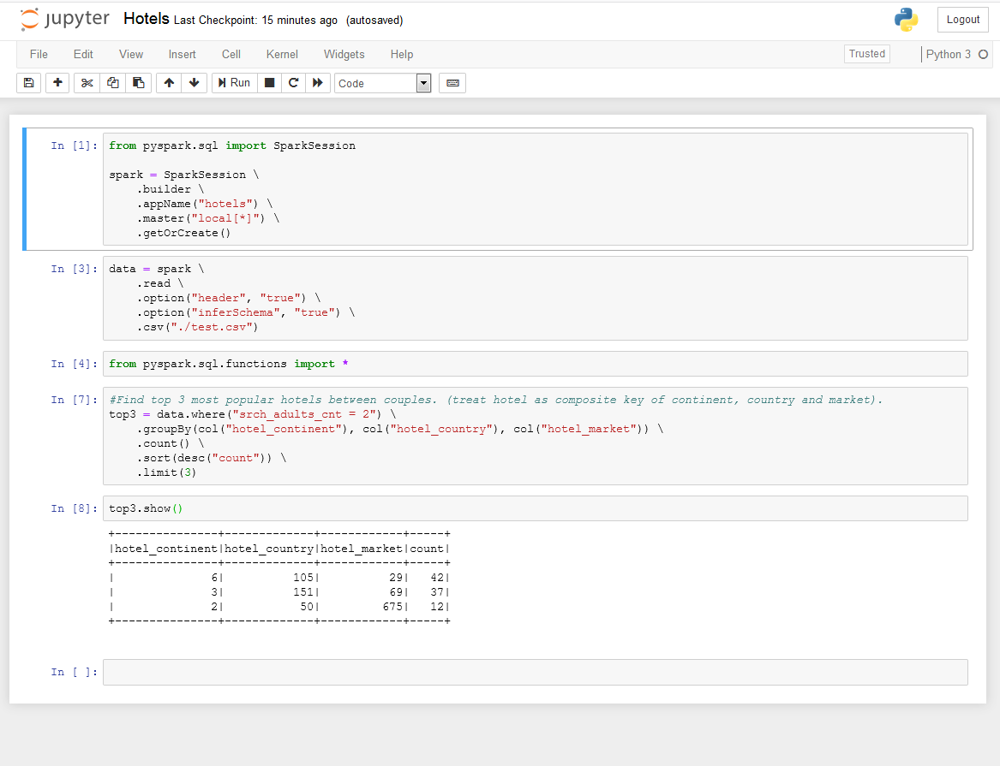
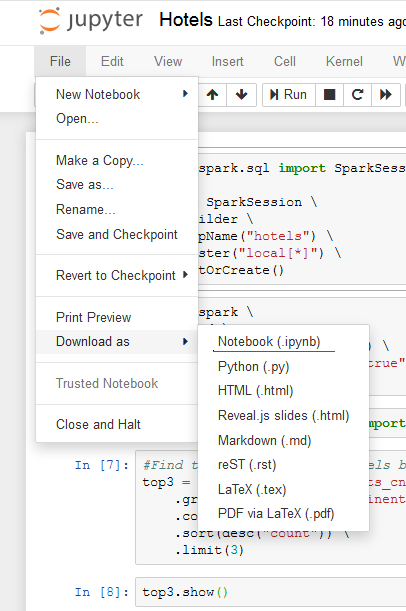

### Download csv files from https://www.kaggle.com/c/expedia-hotel-recommendations/data

### Pull the `jupyter/all-spark-notebook` image and run a container from it: 

```docker run -it --rm -p 8888:8888 jupyter/all-spark-notebook```



### Then open http://<docker-host>:8888 in your browser and copy login token from the console output after running the container:



### Upload csv files to the work directory as follows:




### Open a Python 3 notebook and create a SparkSession configured for local mode (with Task#1):



### After that it is possible to run the notebok.

### To import the notebook as .ipynb, select **Files** > **Download as...** > **Notebook (.ipynb)**


